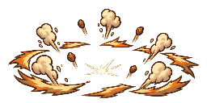

# 28 — BULK 4.0 VFX Style Lock

**Status:** freigegeben und als Produktionsgrundlage von BULK 4.1 umgesetzt

**Stand:** 2026-09-02

**Aktueller Kontext — 2026-09-05:** Dieser Style-Lock bleibt gültige VFX-Produktionsgrundlage; Testzahlen und Folge-Bulk-Aussagen weiter unten sind historische Meilensteinangaben. Die aktuelle Gameplay-Reihenfolge steht in `31_GAMEPLAY_AND_WAVE_COMPLETION_PLAN.md`.

**Stilname:** **Punchy Comic Impact**

## Style Board

| Familie | Comic A | Comic B | Produktionsentscheidung |
|---|---|---|---|
| Physical Light |  |  | **B als Light-Basis:** gerichteter, kompakter, weniger Verdeckung. A als Ausgangsform für Medium/Heavy behalten. |
| Wizard Magic Light |  |  | **B als Light-Basis:** klare vierteilige Magieform. A für größere Zaubertreffer und Residue weiterverwenden. |
| Neutral Ground Impact |  |  | **B als Small/Medium-Basis:** flach und universell. A als Heavy-/Ultimate-Ring. |

## Verbindliche Sprache

- dunkle, handgezeichnet wirkende Kontur statt weicher Stock-Glow-Wolken,
- wenige starke Keile, Sterne, Bögen und Splitter statt Funkenrauschen,
- Physical: Warmweiß → Goldgelb → Orangebraun,
- Wizard Magic: Weiß → Violett → Cyan,
- Ground: Beige/Orange/Umbra; nur abstrakte Ringe, Staub und Debris,
- Light bleibt kompakt, Medium/Heavy darf Formen aus A aufgreifen,
- **Snap → Peak → Breakup → kurzer Rest**; die Figur bleibt lesbar,
- echte RGBA-Transparenz; niemals Arena, Himmel, Gras, Erde, Asphalt oder eine Bodenplatte einbacken.

Little Fighter 2 dient nur als Referenz für Tempo, Größenhierarchie und sofortige Lesbarkeit. Linienführung, Palette und Assets bleiben eigenständige More-Than-Wombat-Gestaltung.

## Implementierter Produktionsmodus

- Der Combat Gym zeigt die Produktionsbibliothek. Button oder Taste `V` schaltet durch Physical-, Magic-, Outcome-, Motion- und Ground-Rezepte; die Vorschau verwendet dieselbe Combat Clock wie echte Treffer.
- `Q` beziehungsweise `VFX full/reduced/minimal` schaltet die optionale Residue-Dichte. Kerninformationen bleiben in jedem Qualitätsmodus sichtbar.
- Bestätigte Kontakte wählen ihr Rezept nur aus Outcome und Stärke. Trefferlogik, Hitstop, Flash, SFX, Haptik und Schadenswerte bleiben unverändert.
- Pause, Frame Step und 1×/0,5×/0,25× laufen über dieselbe Combat Clock; Effekte bleiben im Pause-Frame stehen.

## Technische und visuelle Abnahme 4.0

| Gate | Ergebnis |
|---|---|
| sechs Source-Master mit echtem Alpha | PASS |
| sechs Runtime-Dateien mit transparenten Ecken/Rändern | PASS |
| 128×128 Contact- und 256×128 Ground-Zellen | PASS |
| Park bei 1× | PASS |
| Scrapyard bei 0,25× | PASS |
| Rooftop bei 0,5× | PASS |
| Physical und Magic ohne UI unterscheidbar | PASS |
| echter Wombat-Jab und Wizard-Magic-Kontakt nutzen den Vergleichsmodus | PASS |
| Browser-Konsole ohne Fehler | PASS |
| Typecheck, 33 Tests, Build | PASS |

Reproduzierbares Gate:

```powershell
npm.cmd run vfx:refresh
```

Ergebnisdateien: `docs/qa/vfx-style-lock-latest.md` und `docs/qa/vfx-style-lock-latest.json`.

## Empfehlung und Freigabeentscheidung

**Freigegebene Entscheidung:** Comic B ist die Produktionsbasis für Light Contacts und kleine/mittlere Ground Impacts. Comic A liefert die größere Formensprache für Medium, Heavy und Ultimate. Diese Kombination ist am klarsten, skaliert am besten in Crowd Combat und kommt der gewünschten LF2-artigen Sofortlesbarkeit am nächsten, ohne die vorhandene hochauflösende Comicoptik zu verlassen.

BULK 4.1 setzt diese Entscheidung als datengetriebene Bibliothek mit Physical/Magic Light–Ultimate, Block, Armor, Invulnerable, Dust, Trails und Ground-Rezepten um. Warning Shapes und Signature-Specials folgen gezielt mit BULK 4.2/4.3.

## Bewusste Grenze zu BULK 4.2

Die Prototypen überdecken keine Body-Sheet-Probleme. Im produktiven Wombat-Sheet sind neben Air Bonk auch beim Jab und Belly Slam einzelne Kontakt-/Bodenlinien in Körperframes eingebrannt. Earthshaker enthält eine feste Terrainfläche. Das Entfernen und Neu-Exportieren dieser eingebrannten Layer bleibt ein eigener, kontrollierter Schritt in BULK 4.2; 4.0 ändert keine Character-Sheets.

Source-Provenienz und der reproduzierbare ImageGen-Prompt-Satz stehen in `art-source/vfx/style-lock/README.md`.
