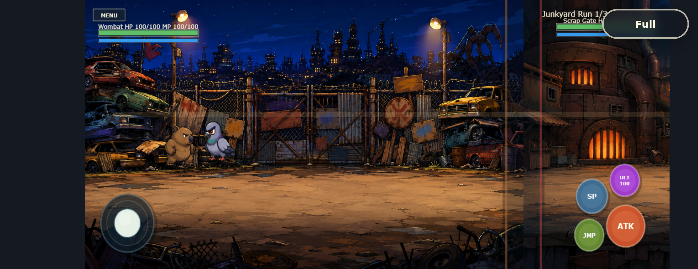
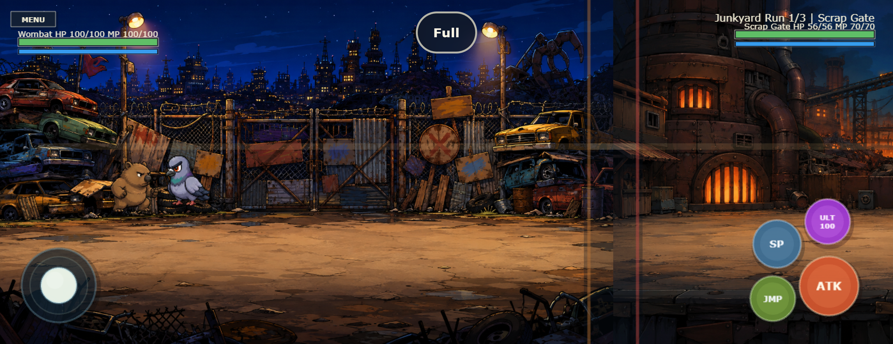

# Mobile Queransicht und Touch-Steuerung – 2026-09-05

## Befund und Korrektur

Die vermuteten Seitenränder und die Verzerrung waren reproduzierbar. Bei 932×360 CSS-Pixeln belegte das Canvas zuvor nur etwa 779×360 Pixel. Drei Ursachen: die Begrenzung auf 1280 logische Pixel, `resize()` statt `setGameSize()` im FIT-Modus und zusätzliches CSS-Flex-Centering neben Phasers eigener Zentrierung. Nach Rotation blieb dadurch zeitweise das alte Display-Seitenverhältnis erhalten.

Die Begrenzung ist entfernt, FIT erhält jetzt die korrekte neue Spielgröße, und Phaser übernimmt allein die Zentrierung. Mehrere Resize-Ereignisse werden pro Frame gebündelt. Die logische Kampfhöhe bleibt 540; breitere Geräte erhalten mehr horizontalen Bildraum, Figuren werden nicht gestaucht. `image-rendering: pixelated` vermeidet eine zusätzliche weiche Skalierung des gerenderten Canvas auf hochauflösenden Displays. Das erzeugt keine neuen Details in bestehenden Rasterassets.

Der Fullscreen-Button liegt kompakt oben mittig und verdeckt das Gegner-HUD nicht mehr. Auf Browsern ohne Fullscreen-Unterstützung bleibt er auch bei Touch-Eingabe verborgen.

## Aktionsbuttons

ATK, SP, ULT und JMP sind einschließlich Ringen, Schatten und Beschriftungen um 10 % vergrößert. Die Anordnung wächst vom unteren/rechten Rand aus mit, wodurch die Zwischenräume erhalten bleiben und keine Kreise überlappen. Gemeinsame Radiuskonstanten definieren Layout und sichtbare Buttons; die Touch-Prüfung verwendet dieselben Kreise. Der kurze Druckeffekt verkleinert nur die Darstellung, nicht die stabile Eingabefläche. Die bestehenden Vektorassets bleiben erhalten; neue Rastergrafiken waren hierfür nicht erforderlich.

| Aktion | Radius vorher → jetzt (Spielpixel) |
|---|---|
| ATK | 42 → 46,2 |
| SP | 34 → 37,4 |
| ULT | 32 → 35,2 |
| JMP | 32 → 35,2 |

## Verifikation

| Ansicht | Canvas vorher | Canvas nachher |
|---|---|---|
| 844×390 Landscape | 844×389,86 | 844×389,86 |
| 390×844 Portrait nach Rotation | 390×180,14, verzerrt/versetzt | 390×219,38, korrekt zentriert |
| 932×360 breites Landscape | 779,33×360, seitlich versetzt | 932×360, volle Breite |

[Vorher-Messwerte](before/mobile-metrics.json) · [Nachher-Messwerte](after/mobile-metrics.json) · [Erfolgreiche Eingabeprüfung und Browser-Version](after/checks.log).

Vorher: 

Nachher: 

Geprüft mit isoliertem Headless Edge, DPR 3, Touch-Emulation: Menu und aktive Wave, Rotation Landscape → Portrait → Landscape, unveränderte Spielerinstanz, Seitenverhältnis und Canvas-Grenzen. Echte Touch-Ereignisse am äußeren Rand jedes vergrößerten Aktionsbuttons lösen jeweils exakt die passende Aktion aus. Joystick-Druck und Loslassen sowie MENU funktionieren nach Rotation. Unit-Tests prüfen zusätzlich acht Randrichtungen pro Button bei 960/1169/1398 Spielpixeln, freie Zwischenräume und getrennte Touch-Kreise.

```powershell
node scripts/check-browser-runtime.mjs http://127.0.0.1:4189/MoreThanWombat/ docs/qa/mobile-2026-09-05/after
```

Browseremulation und Screenshotprüfung sind bestanden. Eine physische iOS-/Android-Geräteabnahme mit Safe Areas, Browserleisten, nativer Vollbildfunktion und Frametimes bleibt offen und gehört weiterhin zum Roadmap-Gate G11.
