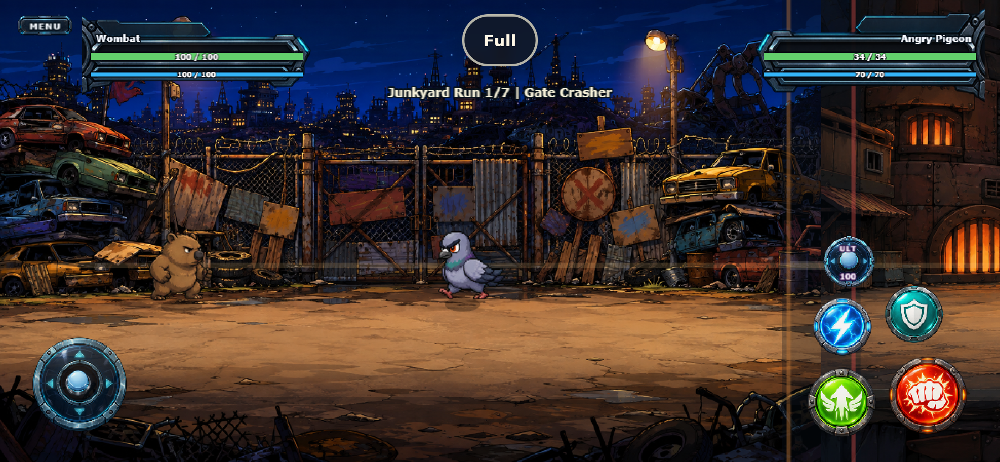
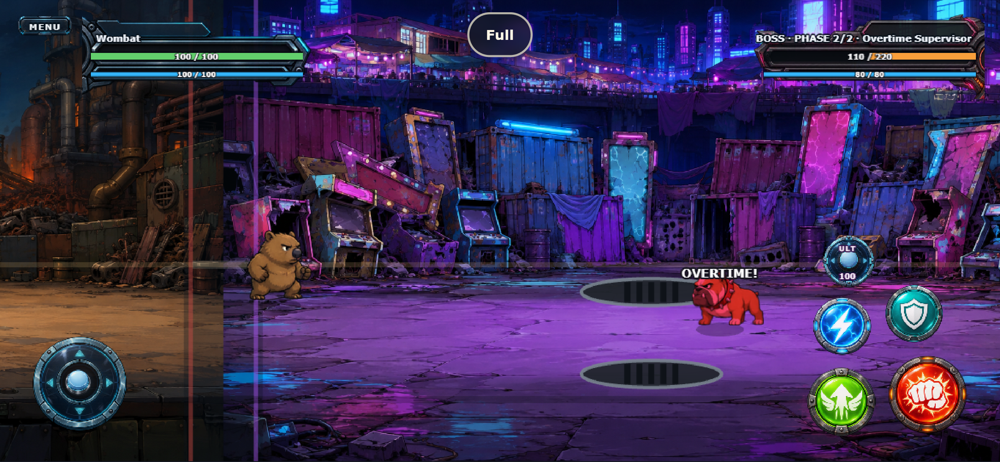

# Battle UI and Touch Controls – 2026-09-09

## Ergebnis

Der temporäre Kreis-/Text-Look wurde durch ein zusammenhängendes, industrielles
Raster-Artset ersetzt. Attack bleibt als häufigste Aktion und Eingang für Basic Chain
sowie Run + Attack der größte Button. Jump ist als wichtigste Bewegungs- und
Rettungsaktion zweitgrößt. Defend liegt nun im rechten Daumenfächer, damit der linke
Daumen gleichzeitig weiter lenken kann. Special, Defend und Ultimate folgen nach
Häufigkeit und Fehlbedienungsrisiko; Ultimate liegt absichtlich am weitesten entfernt.

Die Touch-Erkennung verwendet weiterhin unabhängige, unsichtbare Kreise aus
`MobileControlLayout.ts`. Skalierung, Druckanimation oder Asset-Transparenz verändern
die Hit-Flächen nicht.

## Projektassets

Alle finalen, weboptimierten PNGs liegen unter `public/assets/ui/battle/`:

- `attack_button.png`, `jump_button.png`, `special_button.png`,
  `defend_button.png`, `ultimate_button.png`
- `joystick_base.png`, `joystick_knob.png`
- `player_hud_frame.png`, `boss_hud_frame.png`, `compact_button.png`

Die Action-Assets sind textfrei. Dynamische Kosten und Systemtexte bleiben im Code,
damit sie scharf, korrekt und lokalisierbar sind. Normale Gegner verwenden den
gespiegelten neutralen Rahmen; nur der Overtime Supervisor verwendet den
magenta/orangen Bossrahmen.

## ImageGen-Promptset

Erzeugt mit dem eingebauten ImageGen-Workflow. Gemeinsame Vorgabe: hochwertige,
handgemalte 2D-Game-UI; frontal; klar bei 64–96 Pixeln; leicht abgenutzte industrielle
Metallrahmen; transparente Umgebung; keine Schrift, Zahlen, Wasserzeichen, Szenen oder
zusätzlichen Objekte. Die fünf Aktionen erhielten je ein weißes Symbol und die Farben
Ember-Rot (Fist), Lime (Jump), Cyan (Lightning), Teal (Shield) und Royal Purple
(Ultimate Star). Joystick-Basis und beweglicher Knauf wurden getrennt erzeugt. Für HUD
und Systembutton wurden leere cyan-neutrale beziehungsweise magenta/orange Bossrahmen
im selben Materialstil erzeugt.

## Verifikation

- 96/96 Unit-Tests bestanden.
- Typecheck und Production Build bestanden.
- Mobile Runtime: Landscape, Portrait-Rotation und Wide Landscape ohne Verzerrung.
- Fünf getrennte Rand-Taps lösen exakt die jeweilige Aktion aus.
- Joystick Run, Run + Attack Multitouch, Release und Menu-Touch bestanden.
- G7 Boss-Runtime: 63/63 Checks bei 844×390 und 960×540.
- Keine Browserfehler im erfolgreichen Lauf.

Eine physische iOS-/Android-Abnahme bleibt Teil von G11. Offscreen-Indikatoren,
Restgegner/Fortschritt, Kamera-Feinschliff und Wave-Audio bleiben Teil von G9.

