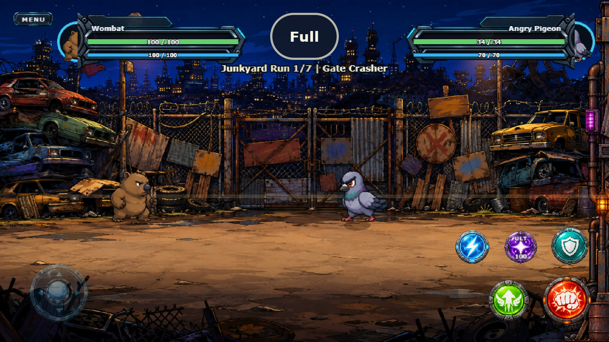
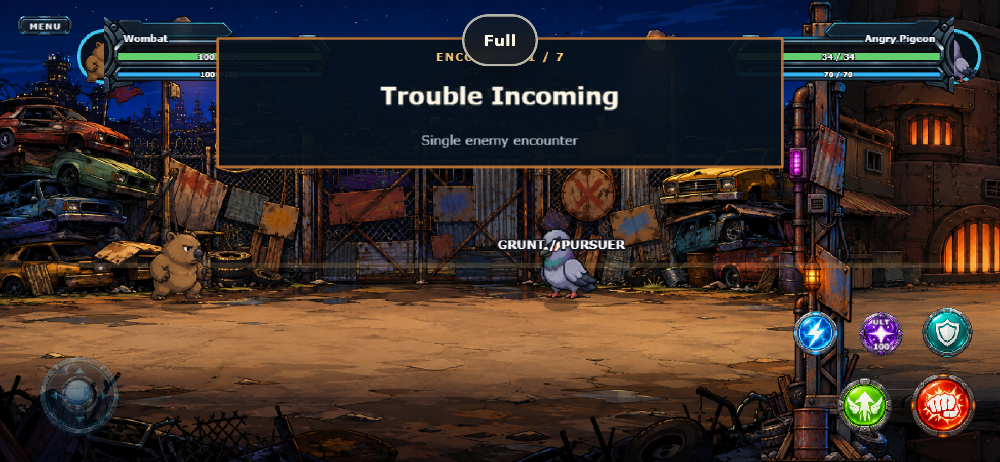
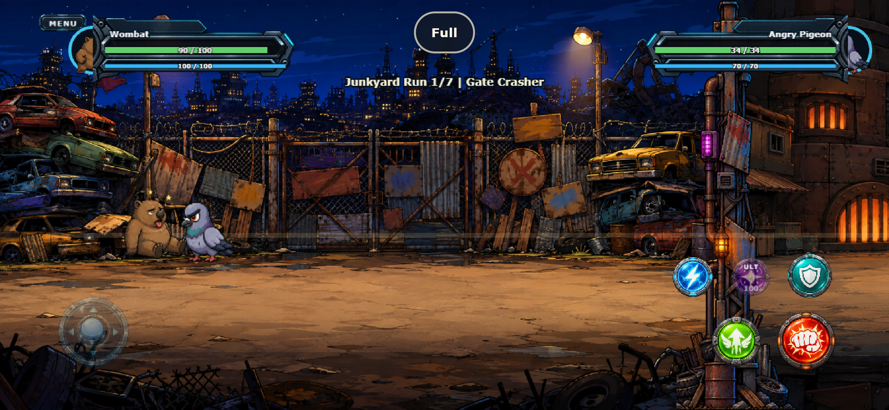

# UI-R1 adaptive input geometry verification

**Date:** 2026-09-10  
**Result:** technically complete; manual physical-device acceptance remains open  
**Next:** UI-R2 production control assets

## Delivered

- compact two-row right-thumb layout with Attack largest, Jump second and Ultimate next to Block;
- independent visible and interactive diameters;
- a minimum 48-CSS-pixel frequent-action hit target at runtime;
- nearest normalized center selection where generous targets overlap;
- CSS safe-area inset conversion into Phaser logical coordinates;
- lower-left bounded floating joystick with clamped origin and clean home return;
- per-pointer action release so one finger cannot reset another held action;
- menu priority and global pointer cleanup.

## Verification

- `npm.cmd test`: 105/105 passed;
- `npm.cmd run build`: passed;
- scripted real-Phaser browser passes at 568×320, 844×390 and 960×540;
- every browser run also checks portrait rotation, return to landscape, 932×430 wide layout and simulated asymmetric safe-area insets;
- real touch dispatch covers five action-edge touches, nearest-target selection, floating Run input, touch Dash Attack, release cleanup and Menu.

Runtime measurements record no browser, console or asset errors:

- [568×320 metrics](568x320/mobile-metrics.json)
- [844×390 log](844x390/checks.log) and [metrics](844x390/mobile-metrics.json)
- [960×540 log](960x540/checks.log) and [metrics](960x540/mobile-metrics.json)

## Visual evidence

Smallest supported landscape class:

Common phone class:

Extra-wide layout with simulated right/bottom/left insets:

## Deliberately still open

- The current perspective joystick and button bitmaps remain placeholders. UI-R2 replaces them with final top-down production assets sized to the new geometry.
- Existing player/enemy HUD frames, portrait handling and resource slots are unchanged in R1. UI-R3 and UI-R4 replace their construction and encounter semantics.
- R1 is browser-emulated evidence, not a claim of physical-device acceptance. Two real-device classes remain part of UI-R5/G11.
