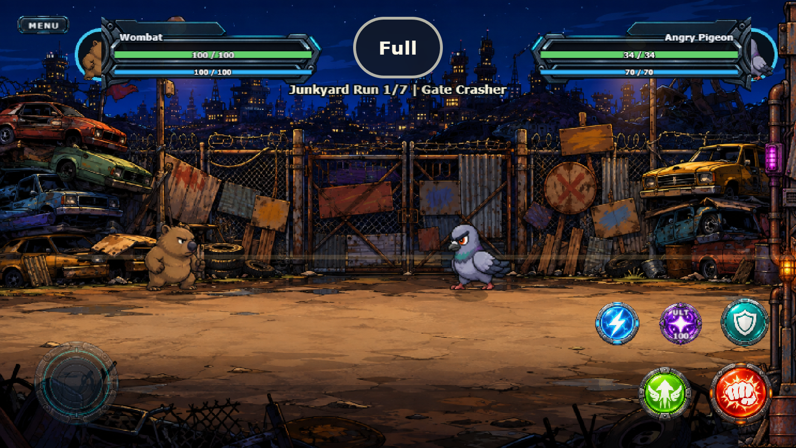
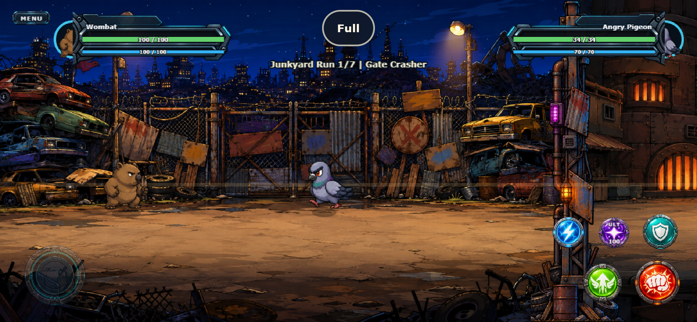
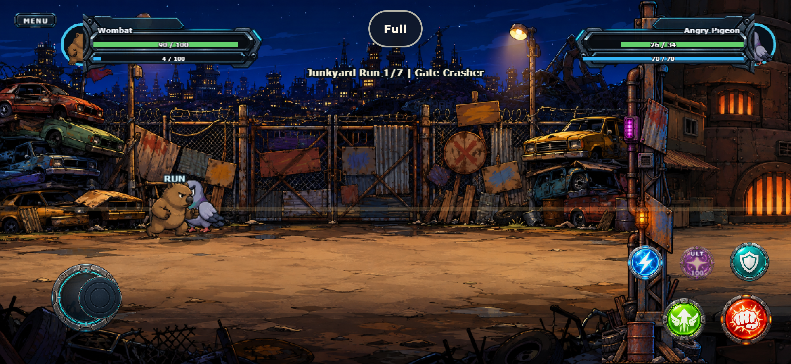
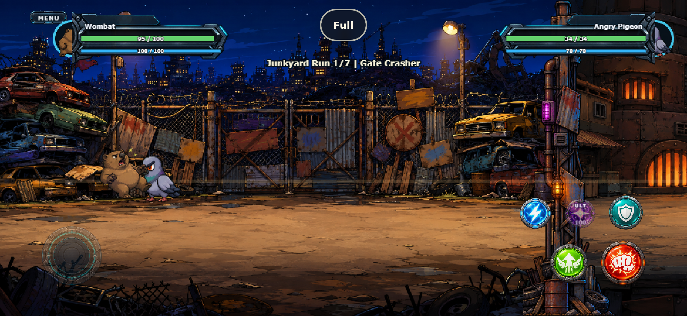

# UI-R2 production control assets

**Date:** 2026-09-10  
**Result:** technically complete; joystick art decision revised after full-HUD comparison  
**Next:** UI-R3 modular HUD construction

## Decision

The five action buttons are retained. They are already individually generated raster paintings with transparent backgrounds, strong silhouettes and distinct red/lime/cyan/teal/purple identities. UI-R1 corrected their hierarchy and placement; regenerating them would spend credits without solving an observed defect.

The generated orthographic pair passed its isolated transparency and circularity checks, but the complete battle view exposed a visual regression: the dark concentric base and knob read as an empty hatch and lost the directional clarity of the original. The runtime therefore uses the original high-contrast base and blue thumb knob again, while retaining R1's smaller 112/70 logical-pixel sizing, bounded floating origin and touch geometry. Idle alpha is raised to 0.52/0.72 so the control remains subordinate without becoming muddy.

## Files

- Source masters: `art-source/ui/battle/joystick_base_topdown_source.png` and `joystick_knob_topdown_source.png`
- Generated alternate pair: `public/assets/ui/battle/joystick_base_topdown.png` (384×384) and `joystick_knob_topdown.png` (256×256)
- Active runtime pair: `public/assets/ui/battle/joystick_base.png` and `joystick_knob.png`
- Runtime loading: `src/game/scenes/PreloadScene.ts`
- Complete built-in ImageGen prompt set: `art-source/ui/battle/README.md`

## Verification

- built-in ImageGen mode, with the existing Attack and Defend buttons as material references;
- actual alpha transparency outside both circular assets;
- opaque width/height difference below 2.5%, preventing perspective flattening;
- transparent corners and more than 88% canvas utilization;
- 106/106 automated tests pass;
- TypeScript and production build pass;
- isolated mobile browser runs pass at 568×320 and 844×390, including rotation, 932×430, safe-area offsets, five action edges, active floating joystick, Run, Dash Attack, release and Menu;
- no browser, console or asset errors.

## Evidence

Physical iOS/Android acceptance remains open for UI-R5/G11.
