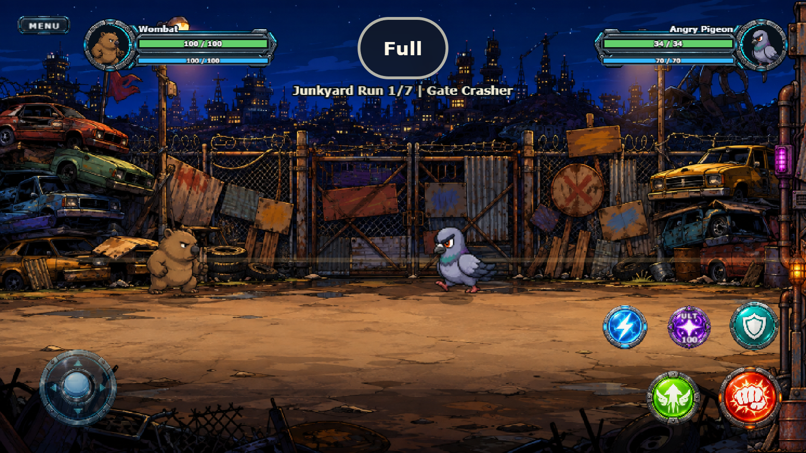
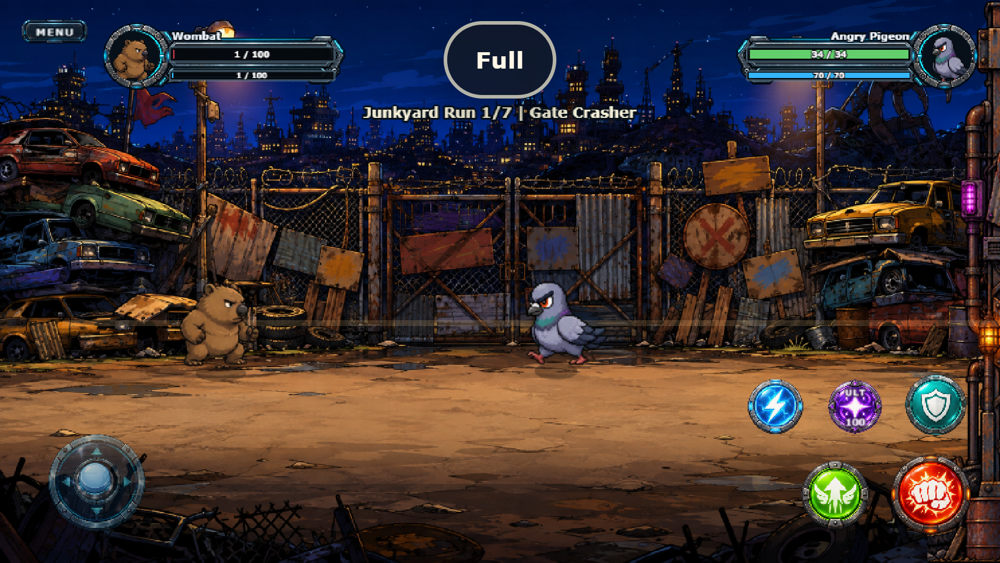
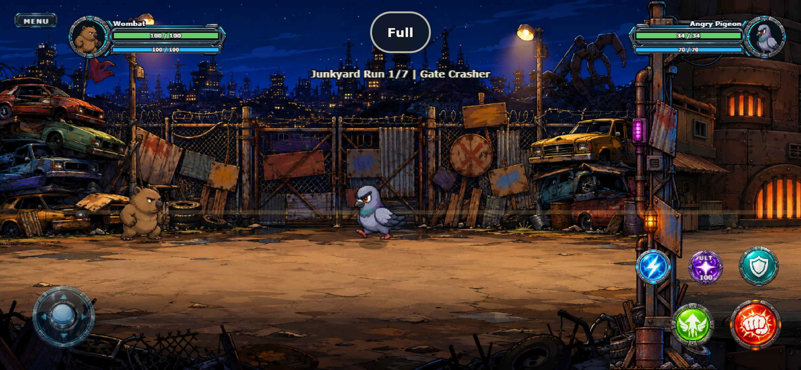
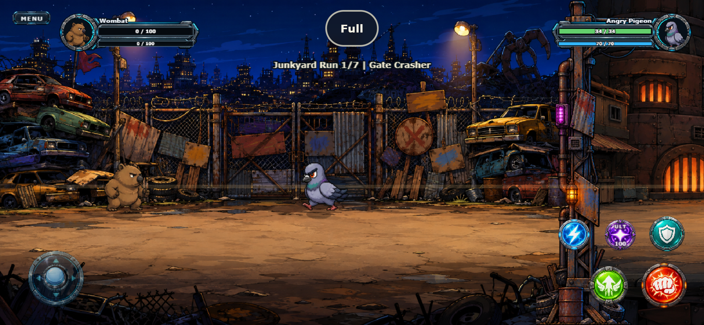
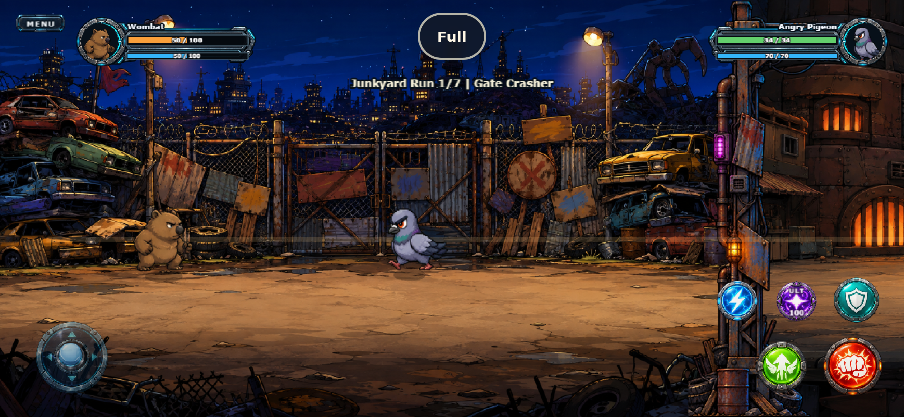
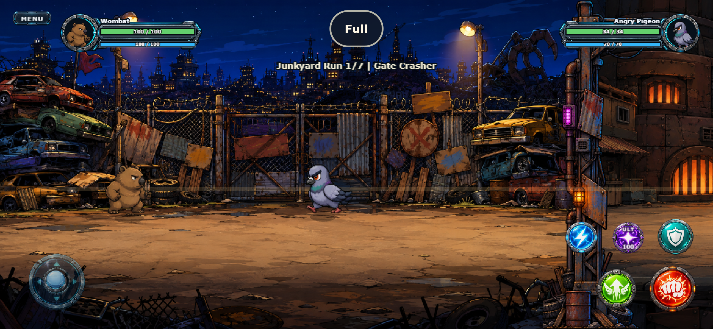

# UI-R3 modular HUD construction

**Date:** 2026-09-10  
**Result:** technically and visually complete in browser emulation  
**Next:** UI-R4 portrait sources and encounter-specific HUD semantics

## Result

The cropped player/boss bitmap pair is no longer loaded by the game. Both persistent HUD sides now use a complete mirrorable 238×72 neutral chassis. Phaser owns every functional layer: portrait mask, label, HP track/fill/value and MP track/fill/value. This prevents bar geometry from drifting with the decorative raster art.

Exact local geometry:

| Module | Rectangle / center |
| --- | --- |
| Chassis | 0,18 — 238×72 |
| Portrait | center 33,36 — radius 24 |
| Label | 67,8 |
| HP slot | 67,27 — 158×14, 3 px inner padding |
| MP slot | 67,50 — 158×9, 2 px inner padding |

The opponent module mirrors the same definition rather than maintaining a second set of guessed percentages. Boss mode uses a magenta functional accent for now; its final persistent strip and phase presentation belong to UI-R4.

## Image asset

- Source master: `art-source/ui/battle/hud_chassis_neutral_source.png`
- Runtime export: `public/assets/ui/battle/hud_chassis_neutral.png` (792×240)
- Prompt and processing record: `art-source/ui/battle/README.md`
- Generated with the built-in ImageGen workflow; failed checkerboard-background boss attempts were rejected and not added to the project

## Verification

- 108/108 automated tests pass;
- TypeScript and production build pass;
- alpha corners and occupied envelope of the runtime chassis are guarded by asset tests;
- pure layout tests verify both frames, portrait sockets and resource slots remain within their envelopes;
- 0%, 1%, 50% and 100% HP/MP fills are tested against the inner bevel mathematically and rendered in Phaser;
- isolated browser runs pass at 568×320 and 844×390, including rotation, 932×430, safe-area offsets and the complete UI-R1/R2 input regression;
- no browser, console or asset errors.

## Evidence

## Deliberately deferred to UI-R4

- dedicated portrait assets and explicit per-fighter crops instead of masked gameplay frames;
- no arbitrary normal-wave enemy in the global upper-right HUD;
- recent-damage local enemy bars, persistent midboss/boss strips and boss phase markers;
- enemy MP hidden unless it has player-facing strategic meaning;
- final boss-specific skin and semantics.

Physical iOS/Android acceptance remains open for UI-R5/G11.

## Post-pass joystick correction

The full R3 battle view made the generated flat R2 joystick read as a dark empty hatch. By owner decision, the original higher-contrast base and blue knob are restored at the smaller R1 dimensions. Floating behavior and touch geometry are unchanged; idle opacity is raised for legibility. The final R3 screenshots include this corrected runtime selection.
